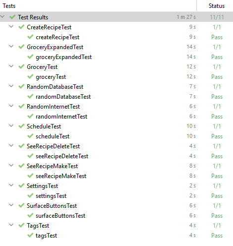

# MyRecipe

Track your recipes, groceries for those recipes and get recipe recomendations

)

# Testing results
Here are the e2e tests

Here are the unit tests and a bad attempt at testing viewmodel with mockito

I had problems with getting mockito to do what i wanted. 
For example specifying a any recipe to be passed.
Tried powermockito, but it did not compile at all

