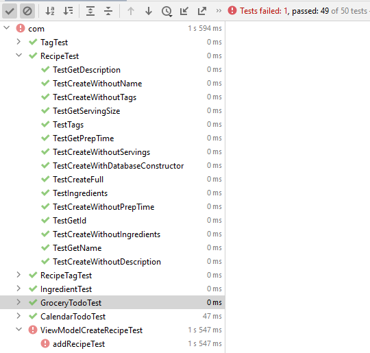

# MyRecipe
 
This is my Android project "My recipe"

Here are the UI tests

Here are the unit tests and a bad attempt at testing viewmodel with mockito

I had problems with getting mockito to do what i wanted. 
For example specifying a any recipe to be passed.
Tried powermockito, but it did not compile at all
